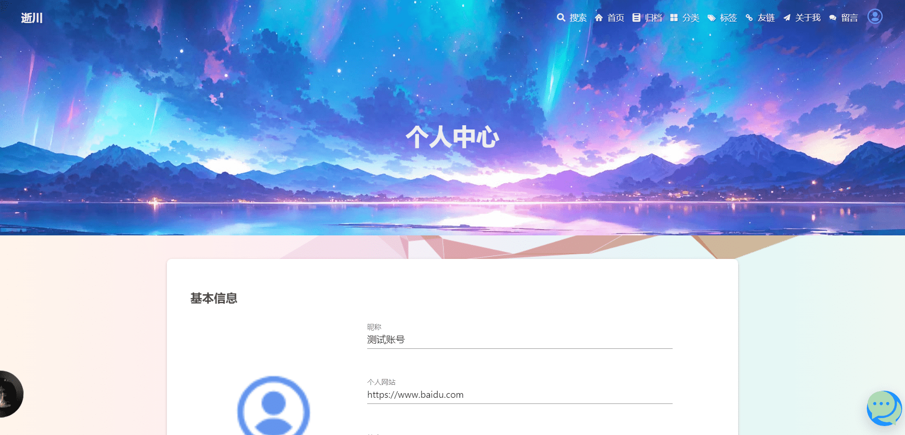

# 博客系统总结

## 写在前面

​		原项目地址：https://github.com/William9527wn/Blog-1

​		我只使用了项目的前端 Vue 应用，后端全手写，重构了后端功能的实现逻辑，重构了数据库表的设计逻辑，登录功能采用的是 SpringSecurity + JWT 令牌的方式实现；原项目的前端存在一些 Bug，经过摸索后已经解决；博客前后台功能基本实现。

## 项目访问地址

前台链接：http://www.scbmc.top

后台链接：http://admin.scbmc.top

后台测试账号：test@qq.com，密码：123456，可登录后台查看

## 项目结构

后端采用 Maven 项目的聚合结构，分为 scblog-admin 后台后端工程，scblog-framework 公共工程，scblog-frontend 前台后端工程：


## 项目技术栈

### 后端

​		使用到的：SpringBoot + Mybatis-Plus + SpringSecurity + JWT + Redis + OSS 文件存储 + ElasticSearch + RabbitMQ + Swagger 2 + EasyExcel + SpringEmail + SpringWebsocket + SpringAOP + FastJson + SpringValidation + Scheduled 定时任务 + 监听器。

- 后端基于 SpringBoot 开发
- 数据库访问使用 MybatisPlus
- SpringSecurity 做权限管理 + JWT 认证
- 缓存使用 Redis
- 七牛云 OSS 实现文件存储
- EasyExcel 导出 excel 文件
- Swagger 2 生成接口文档
- Spring data ElasticSearch 实现文章搜索功能
- Spring Email 实现邮件发送
- Spring Websocket 实现前端聊天室功能
- 基于 SpringAOP 配和自定义注解的方式实现记录系统操作日志功能
- 全局使用 FastJson 作为 Json 转换工具
- 使用 Spring Validation 实现单元方法参数的非空校验

### 前端

- 前台：Vue 2.0 + Hexo，参考 "Hexo" 的 "Butterfly" 设计，美观简洁，响应式体验好；
- 后台：Vue 2.0 + element-admin，侧边栏，历史标签，面包屑自动生成。

#### 有趣的插件

##### 打字机插件

​		插件简介：功能十分强大打字机插件，兼容原生 JS 和 MVVM 类框架（Vue，React，angular），随心所欲的输出任何你想输出的内容。

项目地址：https://github.com/pengqiangsheng/easy-typer-js

整合 Vue：

```vue
<template>	
  <div>
    {{ obj.output }}
    <span class="easy-typed-cursor">|</span>
  </div>
</template>


<script>
import EasyTyper from 'easy-typer-js'
export default {
  name: 'home',
  data() {
    return {
      obj: {
        output: '',
        isEnd: false,
        speed: 80,
        singleBack: false,
        sleep: 6000,
        type: "rollback",
        backSpeed: 40,
        sentencePause: false
      }
    }
  },
  mounted() {
    this.init()
  },
  methods: {
    // 初始化
    init() {
      this.fetchData();
    },
    // 获取文本并填充
    fetchData() {
      //document.title = this.$route.meta.title;
      // 一言Api进行打字机循环输出效果
      fetch("https://v1.hitokoto.cn?c=d")
          .then(res => {
            return res.json();
          })
          .then(( data ) => {
            this.bookFrom = '「' + data.from + '」';
            this.initTyped(data.hitokoto);
          })
          .catch(err => {
            console.error(err)
          })
    },
    //初始化打印内容
    initTyped(input, fn, hooks) {
      const obj = this.obj;
      // eslint-disable-next-line no-unused-vars
      const typed = new EasyTyper(obj, input, (instance)=>{
        // 回调函数 如果这里使用了递归调用会一直循环打印，需要在外部触发停止
        // 此回调用于获取新的数据然后重新输出，实现循环打字效果
        //this.fetchData();
      }, hooks);
    },
  }
}
</script>
```

##### 网易云播放器插件

简介：基于 vue 开发的音乐播放器组件，几行代码即可快速引用到自己的项目当中。

项目地址：https://github.com/montagneme/zwPlayer

==使用该插件的前提是已部署网易云音乐 Api 服务==

需要修改的地方：

> player.vue 文件

```javascript
musicTypeList:[
	{name:'热歌榜',id:在网易云官网页面查看},
	{name:'新歌榜',id:在网易云官网页面查看},
	{name:'飙升榜',id:在网易云官网页面查看},
	{name:'原创榜',id:在网易云官网页面查看},
	{name:'My Songs',id:你的音乐歌单}
],

created() {
	this._getMusicType(你的音乐歌单Id); //刷新页面自动加载的歌单
},

//定时器函数
$('body').on('click',()=>{
    //player.play(); //刷新页面自动播放
    $('body').unbind('click');
})
```

> music.js 文件
>

```javascript
import axios from 'axios'
//将全部的访问地址修改为你部署的网易云音乐 Api 服务地址。
//获取歌词
export const getWords=(id)=>{
    return axios.get(`http://localhost:3000/lyric?id=${id}`);
}
//获取歌曲详情
export const getMusicInfo=(id)=>{
    return axios.get(`http://localhost:3000/song/detail?ids=${id}`);
}
//获取歌曲url
export const getMusicUrl=(id)=>{
    return axios.get(`http://localhost:3000/song/url?id=${id}`);
}
//获取热门歌曲
export const getHotMusic=(id)=>{
    return axios.get(`http://localhost:3000/playlist/detail?id=${id}`);
}
//获取搜索建议
export const getSearchSuggest=(key)=>{
    return axios.get(`http://localhost:3000/search/suggest?keywords=${key}`)
}
//获取歌曲热门评论
export const getHotTalk=(id)=>{
    return axios.get(`http://localhost:3000/comment/music?id=${id}&limit=3`)
}
```


## 项目难点

### 前台后端

1. 登录功能：
   - 数据库设计
   - 后端使用 SpringSecurity 实现：
     - 有些功能必须登录后才能访问，未登录状态无法使用；
     - 自定义认证和授权数据源；
     - 指定全局密码加密策略；
     - 自定义 JWT 认证过滤器；
     - 自定义授权管理器；
     - 配置自定义认证管理器，可以解决自定义认证异常无法抛出的问题；
     - 自定义认证失败和授权失败的异常处理类；
2. 使用 SpringBoot 的全局异常处理机制，抛出异常时，拦截器先于过滤器执行并完成异常捕获；
3. 评论功能实现：
   - 查询评论列表：先分页查询根评论列表，再查询每条根评论下的第一页子评论列表；
   - 新增评论：使用 spring validation 完成评论参数的非空校验；
   - 查询回复评论（子评论）列表，分页查询当前根评论下的子评论；
   - 点赞/取消点赞评论：用户的点赞信息保存到 redis 中，点赞或取消点赞都要更新评论的点赞量。
4. 文件上传使用七牛云的 OSS 对象存储服务实现；
5. 使用 Spring AOP 实现控制器日志收集：
   - 使用环绕通知实现；
   - 自定义注解；
   - 将日志信息写入到数据库。
6. 使用监听器实现博客浏览量的更新：
   - 这里我使用分布式锁实现多个请求同时发出时只记录一个请求的访问量，再将用户 ip 保存到 redis，并更新博客浏览量，就可以保证用户的多个请求只记录一个请求的浏览量；
   - 创建定时任务，每天定时将前一天博客访问量数据保存到数据库中；
   - 创建定时任务，每天定时删除 redis 中的用户访问 ip 信息。

7. 文章的浏览量实现：
   - 通过实现 CommandLineRunner 接口，就可以实现在 SpringBoot 项目启动时，将数据库中查询的文章浏览量保存到 redis 中，后续文章浏览量的新增和查询都是在 redis 中进行；
   - 使用 Scheduled 定时任务每隔一段时间更新 redis 中文章的浏览量到数据库中，保证数据库和 redis 中的数据同步。

8. 使用 spring websocket 实现聊天室功能：
   - 注意：如果使用 Sec-Websocket-Protocol 请求头携带 token 令牌，那么必须在后端设置将相同的 Sec-Websocket-Protocol 响应给前端，否则会一直连接不上 websocket 服务。

9. 文章搜索功能：
   - 首先初始化创建 Elaticsearch 中的索引以及 mapping 关系映射；
   - 创建定时任务，每隔一段时间同步数据库中的文章信息到 es 中；
   - 使用 spring data elasticsearch 实现搜索功能。


### 后台后端

1. 后台登录的权限控制以及菜单动态路由效果实现：
   - 需要实现不同权限的用户登录后所看到的菜单是不同的（动态路由）；
   - 使用 Spring Security 的基于 url 地址的权限管理，不同权限的用户所能使用的功能也是不同的，能看到菜单但是不一定能访问菜单中的资源。
   - 使用 RBAC 思想设计数据库权限模型：用户 - 角色 - 资源（url、菜单）
2. 导出分类信息为 excel 文件；
3. 后台内容的增删该查；
4. 文章状态包含：草稿、已发布、回收站（逻辑删除）、彻底删除
5. 其余删除功能不是真正删除，而是逻辑删除；
6. 在线用户管理：
   - 在线用户列表：从 redis 中获取在线用户 id 集合，使用 stream 流实现分页功能；
   - 下线用户：删除 redis 中存储的用户信息。

7. 角色管理：
   - 新增或修改角色信息，需要回显菜单树；
   - 给角色赋予资源权限，需要回显资源树。


## 运行环境

- 服务器：阿里云 2 核 4 G
- 操作系统：Ubuntu 20.04 LTS
- 对象存储：七牛云 OSS
- CDN：七牛云 CDN 加速

## 开发工具

| 开发工具       | 说明                                              |
| -------------- | ------------------------------------------------- |
| InteIliJ IDEA  | Java 开发工具 IDE                                 |
| WebStorm       | JetBrains 旗下的前端开发工具                      |
| Navicat 16     | Mysql 远程连接工具                                |
| Redis 远程连接 | Redis 远程连接采用新版 IDEA 自带的 Redis 连接功能 |
| Tabby Terminal | SSH 远程连接工具                                  |
| SecureFX 8.3   | FTP 文件传输客户端                                |

## 开发环境

| 环境          | 版本   |
| ------------- | ------ |
| JDK           | 1.8    |
| MySQL         | 8.0.28 |
| Redis         | 5.0.5  |
| Elasticsearch | 7.9.10 |
| SpringBoot    | 2.5.10 |
| Maven         | 3.8.2  |

## 项目截图

### 前台




### 后台


## 项目部署

详情见博客首页基于 jenkins 部署教程 http://www.scbmc.top/articles/38
